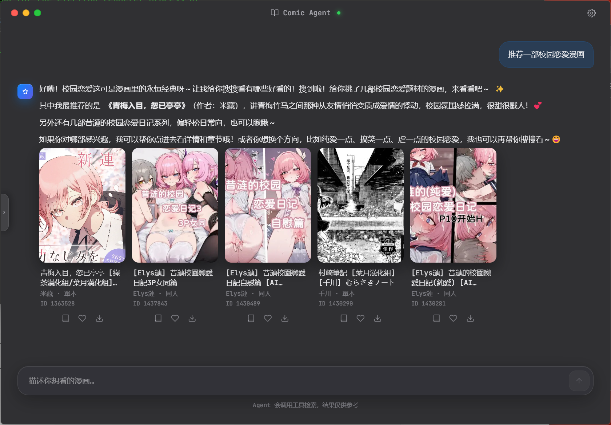
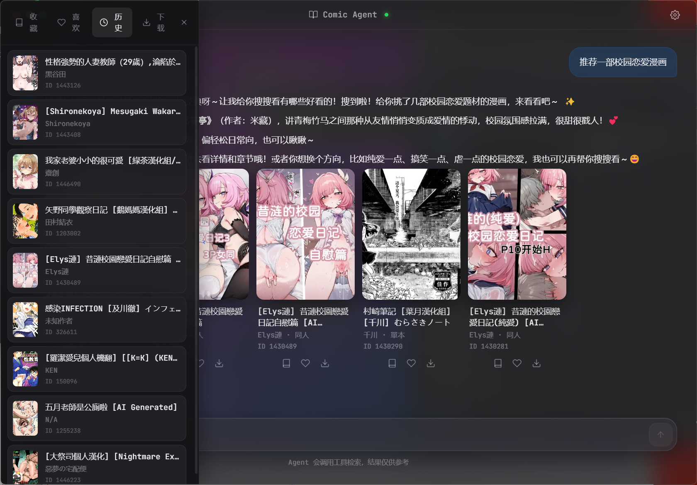
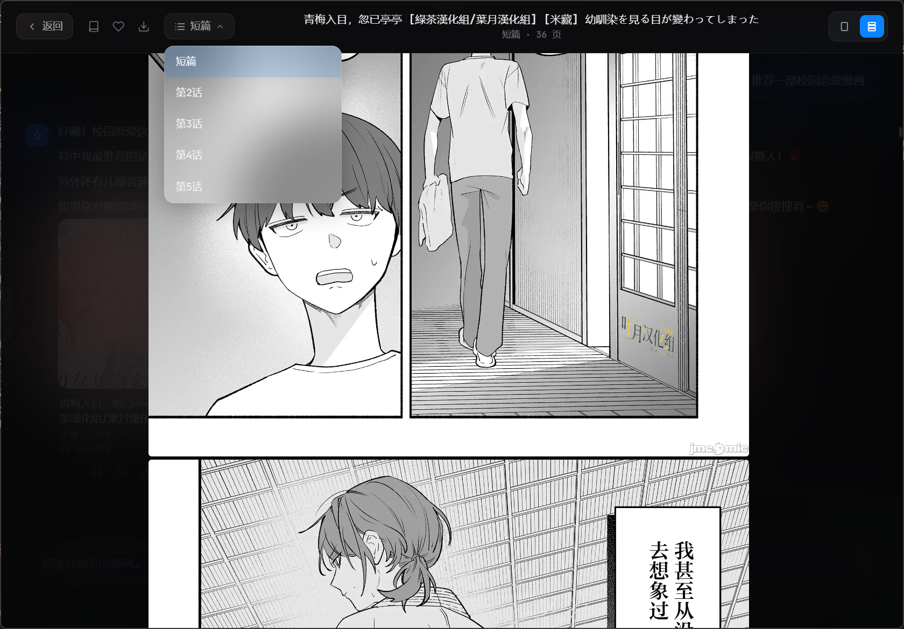
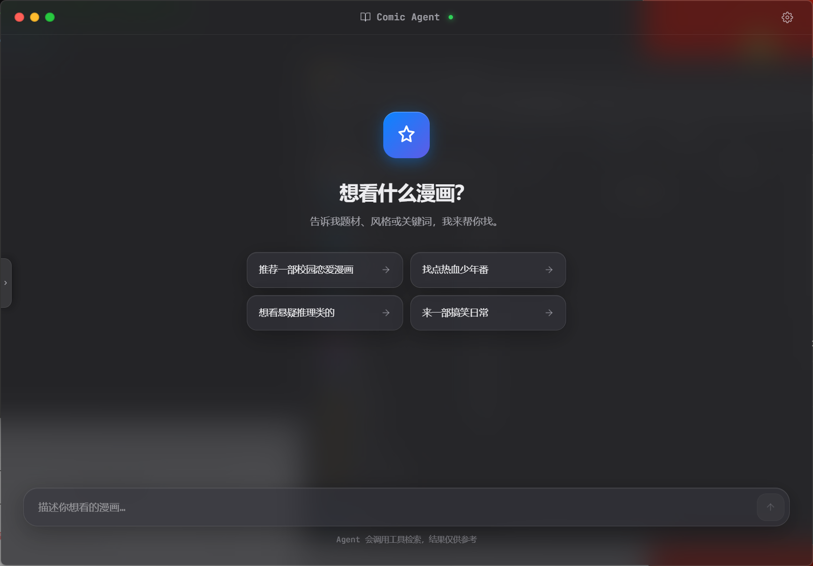
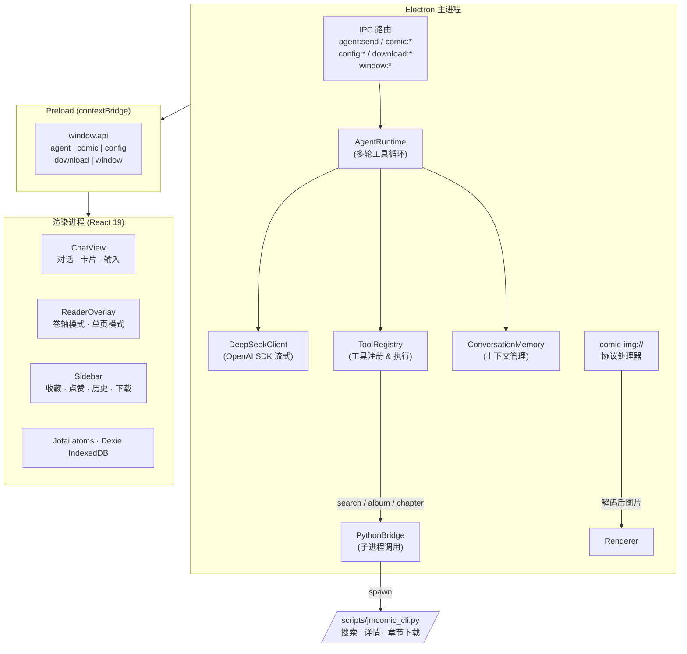

<div align="center">


</div>

<br />

# 🎨 jmComicAgent

> **AI 驱动的漫画阅读桌面应用** —— 用自然语言对话搜漫、发现、阅读，包裹在精致的 macOS 风格界面中。

<div align="center">

### &nbsp;&nbsp;🔍 对话搜漫&nbsp;&nbsp;·&nbsp;&nbsp;🤖 AI 推荐&nbsp;&nbsp;·&nbsp;&nbsp;📖 卷轴 / 单页阅读&nbsp;&nbsp;·&nbsp;&nbsp;⬇️ 批量下载&nbsp;&nbsp;·&nbsp;&nbsp;📚 个人书架

</div>

<br />

## ✨ 功能亮点

<table>
<tr>
<td width="50%">

- **💬 对话式搜漫** —— 用自然语言描述你想看的。试试「有没有校园恋爱喜剧？」「带悬疑标签的、女主是侦探的那种」—— AI 代理帮你找到。

- **🎯 个性化推荐** —— 应用从你的收藏、点赞、阅读历史中学习口味。说「推荐几部我喜欢的那种」，它会交叉比对你的偏好画像和漫画库，告诉推荐理由。

- **🖼️ 智能卡片展示** —— 搜索结果直接渲染为漫画卡片（封面、标题、作者、分类标签），不再面对满屏 JSON。

- **📖 双模式阅读器** —— 卷轴模式（连续滚动）或单页模式（键盘左右翻页），随你切换。

</td>
<td width="50%">

- **🧠 智能工具调用** —— AI 代理自主调用工具链：`search_comic` → `get_album_detail` → `get_chapter_pages`，最多 10 轮工具调用循环。

- **🔐 自带 Key，不作恶** —— 你提供自己的 API Key。支持 DeepSeek、OpenAI、OpenRouter 或任何 OpenAI 兼容接口。在设置面板修改即时生效，无需重启。

- **⬇️ 智能下载** —— 一键下载整个漫画的每一话，逐话显示进度。图片自动解码（JM 专属扰码算法），本地缓存，通过自定义 `comic-img://` 协议供给渲染进程——扰码图片你见不到。

- **🪟 Acrylic / Vibrancy** —— Windows 11 亚克力毛玻璃 + macOS 程序坞模糊。隐藏式标题栏 + 自定义红绿灯按钮，沉浸式阅读体验。

</td>
</tr>
</table>

<br />

## 🖥️ 界面一览

<table>
<tr>
<td width="50%" align="center">
  <strong>💬 对话搜漫</strong><br />
  
</td>
<td width="50%" align="center">
  <strong>📚 个人书架</strong><br />
  
</td>
</tr>
<tr>
<td width="50%" align="center">
  <strong>📖 漫画阅读器</strong><br />
  
</td>
<td width="50%" align="center">
  <strong>🏠 主界面</strong><br />
  
</td>
</tr>
</table>

<br />

## 🧱 架构概览



<br />

### 数据流

| 步骤 | 说明 |
|------|------|
| 1️⃣ | 用户在 ChatView 输入自然语言 |
| 2️⃣ | 渲染进程通过 `window.api.agent.send()` → IPC → AgentRuntime |
| 3️⃣ | AgentRuntime 发送消息到 DeepSeek（/OpenAI）API，获取回复 |
| 4️⃣ | LLM 返回 tool_calls → AgentRuntime 执行对应工具（search_comic / get_album_detail / etc.） |
| 5️⃣ | 工具通过 PythonBridge 调用 `jmcomic_cli.py`，结果返回 LLM 继续推理 |
| 6️⃣ | 多轮循环结束后，最终文本 + 结构化数据推送到 ChatView |
| 7️⃣ | 阅读器通过 `comic-img://` 协议加载本地已解码图片 |

<br />

## 🚀 快速开始

### 前置条件

- **Node.js** ≥ 18
- **Python** ≥ 3.8，需安装 `jmcomic`
- **Clash Verge**（或兼容代理）运行在 `127.0.0.1:7897` —— JM API 和图片 CDN 需要走代理
- **DeepSeek API Key**（或任意 OpenAI 兼容接口的 Key）

### 安装

```bash
# 1. 克隆仓库
git clone https://github.com/<你的用户名>/jmComicAgent.git
cd jmComicAgent

# 2. 安装 Node 依赖
npm install

# 3. 安装 Python jmcomic 库
pip install jmcomic
```

### 配置代理

```bash
# （可选）自定义代理地址，默认 http://127.0.0.1:7897
export JM_PROXY=http://127.0.0.1:7890
```

### 启动

```bash
npm run dev
```

应用启动后，点击右上角 **⚙️ 设置**，填入你的 API Key 和模型，即可开始对话搜漫。

> [!TIP]
> 应用默认使用 DeepSeek API。如果想用 OpenAI，在设置中将 `baseUrl` 改为 `https://api.openai.com/v1` 即可。

<br />

## ⌨️ 快捷键

| 按键 | 作用 |
|------|------|
| <kbd>Ctrl</kbd> + <kbd>K</kbd> | 聚焦聊天输入框 |
| <kbd>→</kbd> / <kbd>←</kbd> | 上一页 / 下一页（单页阅读模式） |
| <kbd>Esc</kbd> | 关闭阅读器 / 关闭设置面板 |

<br />

## 🛠️ 技术栈

| 层 | 技术 |
|---|------|
| **桌面壳** | Electron 33, electron-vite |
| **前端** | React 19, TypeScript 5.7, Tailwind CSS 4 |
| **状态管理** | Jotai |
| **动画** | Framer Motion |
| **AI SDK** | OpenAI Node.js SDK（兼容 DeepSeek / OpenAI） |
| **本地数据库** | Dexie.js（IndexedDB 封装） |
| **配置持久化** | electron-store |
| **Python 桥接** | Node child_process → `scripts/jmcomic_cli.py` |
| **漫画 API** | [jmcomic](https://github.com/tonquer/jmcomic) Python 库 |
| **Markdown 渲染** | react-markdown + remark-gfm |

<br />

## 📁 项目结构

```
jmComicAgent/
├── src/
│   ├── main/                    # Electron 主进程
│   │   ├── index.ts             # 应用入口、窗口创建、comic-img:// 协议
│   │   ├── ipc-handlers.ts      # 所有 IPC 通道：agent、comic、config、download、window
│   │   ├── PythonBridge.ts      # 调用 Python CLI，180s 超时，JSON 管道通信
│   │   ├── ConfigStore.ts       # JSON 文件配置（API Key、模型、Base URL）
│   │   ├── windowRef.ts         # 主窗口引用（供 tool 和 protocol 使用）
│   │   └── agent/
│   │       ├── AgentRuntime.ts  # 多轮工具调用循环（最多 10 轮）
│   │       ├── DeepSeekClient.ts# OpenAI SDK 流式封装
│   │       ├── ToolRegistry.ts  # 工具定义与执行注册表
│   │       ├── ConversationMemory.ts # 对话上下文管理，原子化裁剪
│   │       └── tools/
│   │           └── register-tools.ts # search_comic、get_album_detail 等工具
│   ├── preload/
│   │   └── index.ts             # contextBridge 暴露 API：window.api
│   └── renderer/
│       ├── index.html           # 入口 HTML
│       └── src/
│           ├── App.tsx           # 根组件
│           ├── components/       # ChatView、ReaderOverlay、Sidebar 等组件
│           ├── atoms/            # Jotai 状态原子（设置、阅读器、侧边栏、Toast）
│           ├── hooks/            # useAgent、useDownload
│           ├── db/               # Dexie IndexedDB 表结构
│           └── library/          # 用户偏好画像聚合
├── scripts/
│   └── jmcomic_cli.py           # Python CLI：search / album / chapter 三个子命令
├── package.json
├── tsconfig.json
└── electron.vite.config.mts
```

<br />

## 🔧 环境变量

| 变量 | 默认值 | 说明 |
|------|--------|------|
| `JM_PROXY` | `http://127.0.0.1:7897` | JM API 和图片 CDN 的 HTTP 代理地址 |

其余配置（API Key、模型、Base URL）均在应用内通过 **设置面板** 修改，持久化到 `config.json` 文件。

<br />

<details>
<summary>📖 展开：JM 图片扰码与解码流程</summary>

<br />

JM 漫画的页面图片经过扰码处理 —— 图片横向切段后按 md5 派生序列重排，原始 CDN 地址直接放入 `` 标签显示的是一张拼图乱码。

本应用的解码管线：

1. 用户在聊天中要求查看某话
2. Agent 调用 `get_chapter_pages` → Python `jmcomic` 库下载扰码图片 → 在本地解码并写入 `~/.jmcomic` 目录
3. 本地文件路径通过 `comic-img://cache/<encoded-path>` 发回渲染进程
4. 主进程 `protocol.handle('comic-img')` 验证路径在缓存目录内后，将文件内容作为 Response 返回
5. 页面正常渲染出清晰的漫画原图

`download.image.decode: true` 是整个流程的关键开关，它让下载器在写入磁盘前完成解码，所以原始路径存的是已解码图片，可以安全重复读取。

</details>

<br />

## 📄 开源协议

MIT — 详见 [LICENSE](LICENSE) 文件。

<br />

<div align="center">

用 ❤️ 构建 · 基于 Electron + React + DeepSeek

</div>
